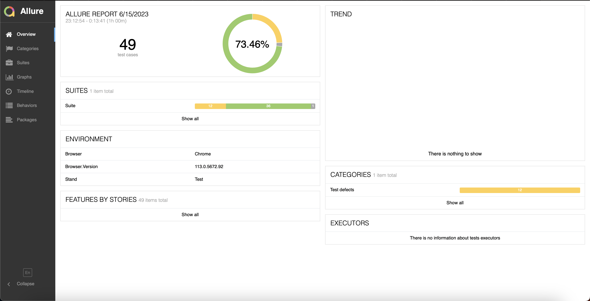
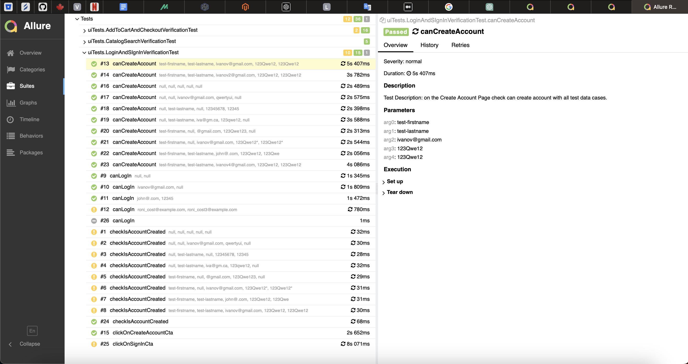
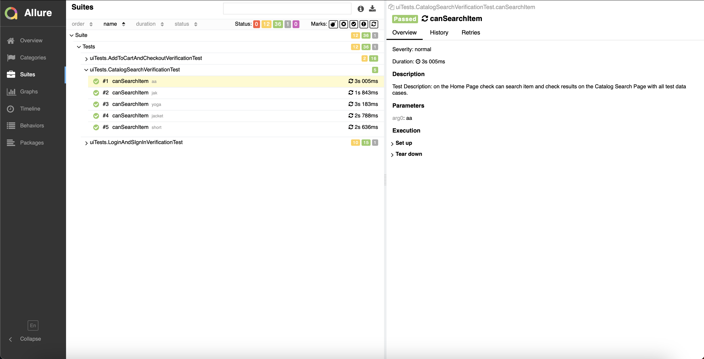
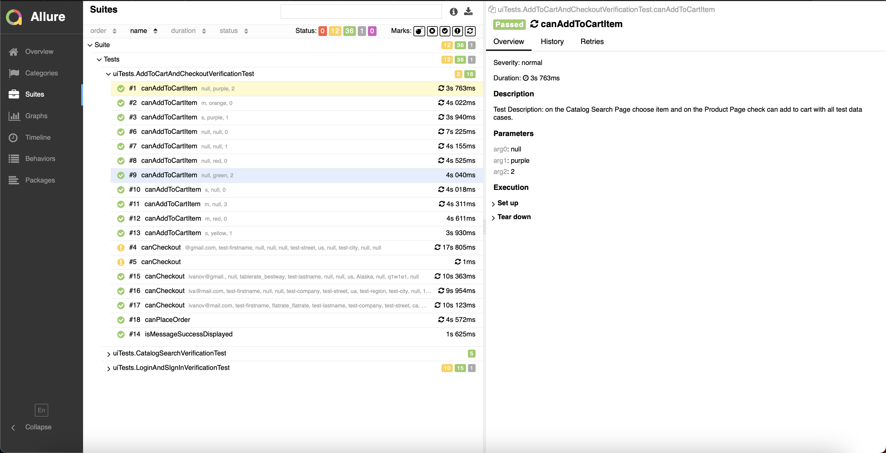

# Project Title

## Overview

This repository contains the test scripts for the following functionalities in our application:

1. User Registration and Login
2. Product Search Functionality
3. Add-to-cart Functionality
4. Checkout Process

These tests are designed to verify the basic operations of the application and ensure the stability of its main functionalities.

## Page Object Model (POM) Classes

In our Selenium-based automation tests, we leverage the Page Object Model (POM) design pattern, which enhances test maintenance and reduces code duplication. POM classes represent a direct mapping of the application's user interface. Each page in the application corresponds to a class in the test framework.
All POM classes extend BasePage which has protected driver and common abstract methods.

1. **HomePage.java**: This class contains web elements and methods related to the Home page.
2. **LoginPage.java**: This class contains web elements and methods needed for Login functionality.
3. **CreateAccountPage.java**: This class includes the elements and methods needed for Create Account functionality.
4. **MyAccountPage.java**: This class contains web elements and methods related to the MyAccount page.
5. **CatalogSearchPage.java**: This class hosts the elements and methods needed for Catalog Search functionality.
6. **ProductPage.java**: This class hosts the elements and methods related to the Product page.
7. **CheckOutPage.java**: The elements and operations related to the checkout process are captured in this class.
8. **ShippingAddressPage.java**: This class represents the elements and methods needed for Shipping Address functionality.
9. **PaymentPage.java**: The elements and operations related to the payment process are captured in this class.

## How to Run Tests

Follow these steps to run the tests:

1. **Prerequisites**:
    - Install Java JDK (version 11 or higher) on your machine.
    - Install Maven on your machine.
    - Make sure you have a copy of this repository on your local machine.

2. **Set Up**:
    - Navigate to the directory where the project is located on your machine via the terminal/command prompt.
    - Ensure the `pom.xml` file is present in the root directory. This file contains the necessary dependencies for the project.

3. **Running the Tests**:
    - Run the command: `mvn clean test`
    - This command will start executing the tests.

4. **Test Reports**:
    - After the test execution, a test report will be generated in the `target/allure.results` directory.

## Screenshots

- General Report
  

- User Registration and Login Test Result
  

- Product Search Functionality Test Result
  

- Add-to-cart Functionality and Checkout Process Test Result
  

---